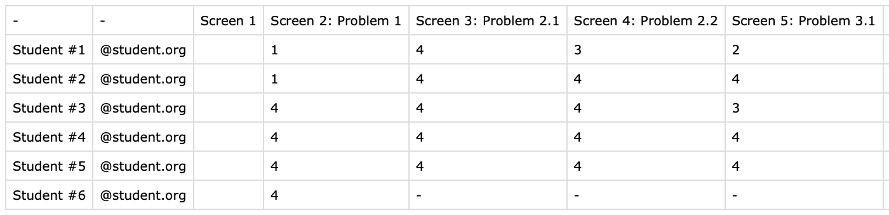
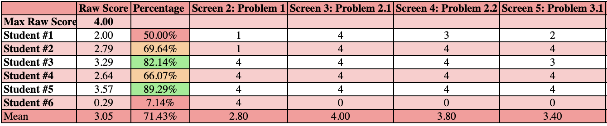

# Desmos Assessment CSV Formatter

This tool is designed to cleanly format CSV files exported from Desmos assessments, enhancing readability and making data analysis simpler and more efficient.

## Features

- **Color-Coded Final Grades**: Automatically applies color formatting to final grades for easy visual interpretation, allowing quick insights into performance distribution.
  
- **Customizable Total Points**: Easily adjust the total possible points for the assessment to fit your grading scale or specific requirements.

- **Streamlined Data**: Removes extraneous columns that Desmos generates, leaving only the essential information you need.

- **Average Score Calculation**: Calculates and displays averages across all scores, giving a clear view of overall performance.

- **Improved Visual Presentation**: Formats the data to be visually appealing and presentable, making it easy to share or review at a glance.

This tool makes it easy to analyze, interpret, and present Desmos assessment data, giving you a clean and organized file with meaningful formatting and insights.

## Before

## After

## Run Instructions

Follow these steps to cleanly format your Desmos assessment data in Microsoft Excel:

1. **Download the CSV File from Desmos**  
   - Log in to your Desmos account, navigate to the assessment, and download the CSV file containing the assessment data.

2. **Download the .bas File from GitHub**  
   - Go to this GitHub repository and download the `.bas` file that contains the VBA code for formatting the assessment data.

3. **Open the CSV File in Microsoft Excel**  
   - Locate the downloaded CSV file from Desmos, and open it in Microsoft Excel.

4. **Enable the Developer Tab in Excel**  
   - If you haven’t already, enable the Developer tab in Excel by following these steps:
     - Go to **File** > **Options** > **Customize Ribbon**.
     - Check the box for **Developer** on the right side, then click **OK**.

5. **Open the Visual Basic for Applications (VBA) Editor**  
   - On the **Developer** tab, select the **Visual Basic** icon on the far left to open the VBA editor.

6. **Import the .bas File**  
   - In the VBA editor, go to **File** > **Import File...**.
   - Select the `.bas` file you downloaded from GitHub. This will import the VBA code into the editor.

7. **Run the Program**  
   - With the VBA editor open, press **F5** or click the **Run** button to execute the program.
   - The macro will format and organize your data, adding color coding, calculating averages, and making the sheet ready for analysis.

8. **Review the Formatted Data**  
   - Return to the main Excel window to see your formatted data, ready for analysis and reporting.

Your data should now be organized, color-coded, and formatted for easy analysis and interpretation!

## For Google Sheets Users
- Here is a [Google Sheets Version](https://docs.google.com/spreadsheets/d/12tEgGnu2XUWp_lysDMmaJoaqYPLFleDojGXLfr7j31c/copy) to Copy

